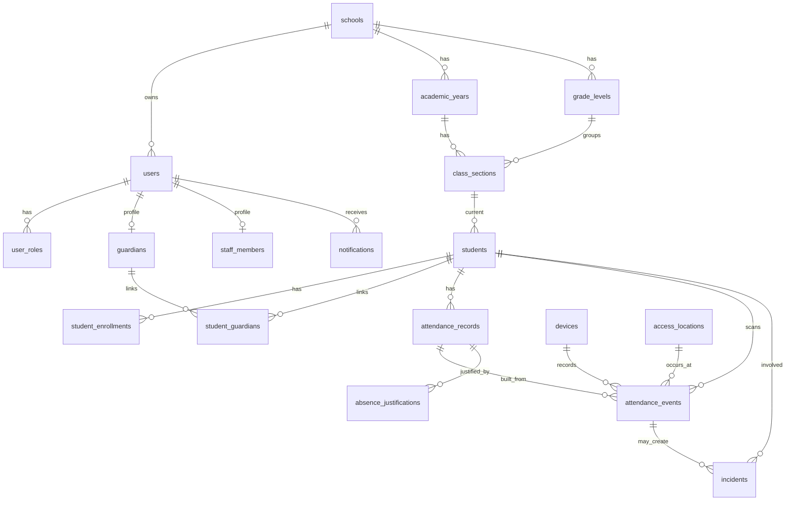

# Diseno de base de datos para Colecheck

## Decision

La mejor base para este sistema es PostgreSQL en Docker.

Motivo: Colecheck no es solo una app de formularios. Necesita datos relacionales con reglas claras: colegio, usuarios, roles, estudiantes, apoderados, cursos, asistencia diaria, eventos de escaneo, incidencias, justificaciones, dispositivos, notificaciones y auditoria. PostgreSQL cubre eso con integridad referencial, indices, vistas de reporte, transacciones y `jsonb` para metadatos flexibles de dispositivos o biometria.

Dockerizarla si conviene para la VPS. Permite desplegar la base de forma repetible, mantener volumen persistente, aislar configuracion y luego conectar la API en la misma red privada. No se debe exponer PostgreSQL a internet; el `docker-compose.yml` liga el puerto a `127.0.0.1`.

## Que cubre el esquema

- Multi-colegio: casi todas las tablas llevan `school_id`.
- RBAC: usuarios separados de roles, para que una persona pueda ser apoderado y personal si hiciera falta.
- Estudiantes y apoderados: relacion muchos-a-muchos mediante `student_guardians`.
- Cursos y gestion academica: anios lectivos, grados, secciones y matriculas.
- Asistencia: separa `attendance_events` de `attendance_records`.
- QR y biometria: almacena hash/referencia, no secretos ni rostros crudos.
- Incidencias: permite casos con o sin estudiante identificado.
- Justificaciones: flujo de solicitud y revision para faltas.
- Notificaciones: cola por canal (`app`, `sms`, `email`, `whatsapp`).
- Dispositivos: moviles, lectores QR, camaras y ubicaciones.
- Auditoria: registro de acciones sensibles.

## Modelo conceptual



## Regla clave de asistencia

`attendance_events` es el historial inmutable de lo que paso: QR aceptado, rostro rechazado, registro manual, salida, error, etc.

`attendance_records` es el estado diario consultable por dashboard y app: presente, retraso, falta, justificado o pendiente.

El esquema incluye un trigger:

```sql
attendance_events_apply_daily_record
```

Cuando entra un evento aceptado con estudiante y estado, la base crea o actualiza automaticamente el registro diario. Asi el sistema conserva auditoria completa sin perder una lectura rapida para la UI.

Tambien quedan dos vistas listas para reportes:

- `v_school_daily_attendance_summary`: resumen por colegio y dia para el dashboard general.
- `v_daily_attendance_summary`: resumen por colegio, curso/seccion y dia.

## Decisiones importantes

- Las contrasenas van en `users.password_hash`, nunca como texto plano.
- Los QR van en `student_qr_credentials.token_hash`, no como payload crudo.
- La biometria usa `biometric_profiles.template_ref` y `template_hash`; la recomendacion es guardar plantillas reales en un servicio/almacen cifrado, no una imagen facial cruda en PostgreSQL.
- `school_id` prepara el sistema para crecer a varias instituciones sin redisenar.
- `jsonb` se usa solo para metadatos cambiantes, no para reemplazar tablas importantes.

## Archivos creados

- `database/init/001_schema.sql`
- `database/init/002_seed_demo.sql`
- `database/docker-compose.yml`
- `database/.env.example`
- `database/README.md`

## Siguiente paso natural

Cuando pasemos a la API, conviene crear un backend con migraciones formales sobre este esquema. Recomendacion probable: Node.js con NestJS o Fastify, PostgreSQL y Prisma/Drizzle, manteniendo este SQL como base de referencia inicial.
